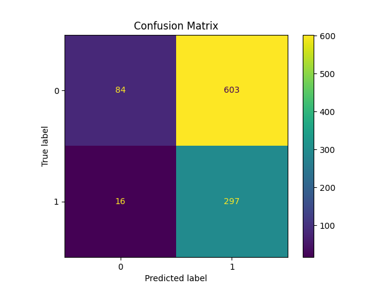
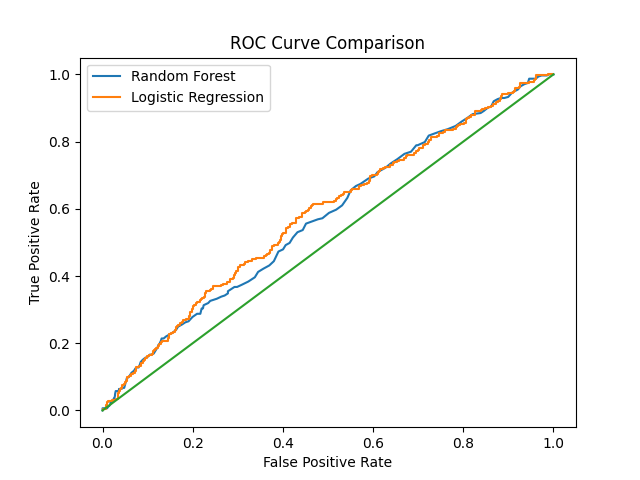
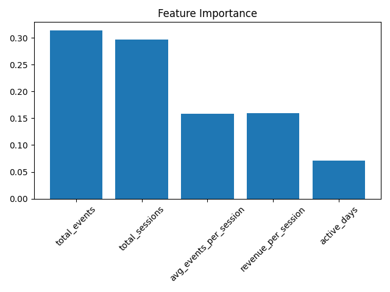
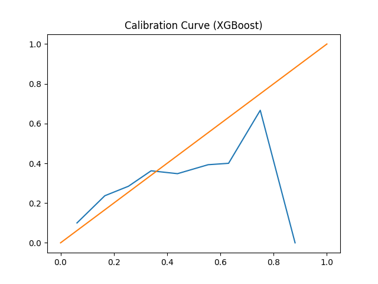
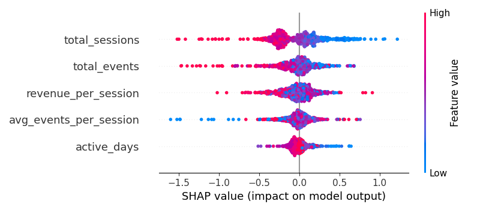
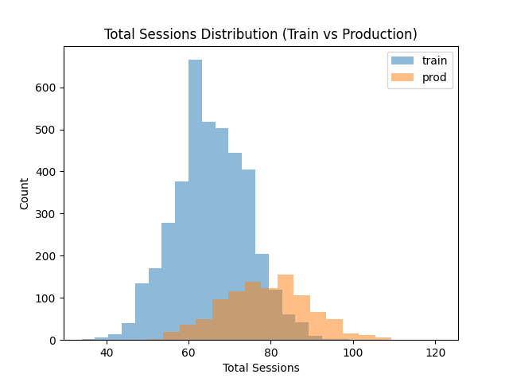

# ML-PulseChecker  
### A Production-Style Churn Prediction System (FastAPI + Docker)


---

## Why I Built This

I wanted to go beyond notebook-based ML experiments and build something closer to how machine learning systems actually run in production.

This project simulates a real product analytics workflow:
- Train a churn prediction model
- Evaluate it properly
- Optimize the decision threshold
- Serve it through an API
- Containerize it for reproducibility

The goal wasn’t to use as many tools as possible but was to build one clean, end-to-end ML system correctly.

---

## Problem

Predict whether a user will churn based on behavioral product metrics:

- `total_events`
- `total_sessions`
- `avg_events_per_session`
- `revenue_per_session`
- `active_days`

This mirrors churn prediction problems commonly seen in SaaS and consumer platforms.

---

## Modeling Approach

**Model:** RandomForestClassifier  
**Train/Test Split:** 80/20 (Stratified)

### Evaluation

Instead of focusing only on accuracy, I evaluated the model using:

- ROC-AUC
- Precision
- Recall
- F1 Score
- Confusion Matrix

### Threshold Tuning

Rather than using the default 0.5 cutoff, I optimized the classification threshold using the Precision-Recall curve to maximize F1 score.

In real-world systems, the decision threshold directly affects business tradeoffs between false positives and false negatives — so this step matters.

---

## System Flow

```
Data
  → Feature Engineering
  → Model Training
  → Model Serialization (joblib)
  → FastAPI Inference Service
  → Docker Container
```

The trained model is saved and loaded inside a REST API for real-time inference.

---

## API Endpoints

### Health Check

**GET** `/health`

```json
{ "status": "ok" }
```

Added to simulate production readiness checks.

---

### Prediction

**POST** `/predict`

Example request:

```json
{
  "total_events": 120,
  "total_sessions": 15,
  "avg_events_per_session": 8,
  "revenue_per_session": 2.5,
  "active_days": 20
}
```

Response:

```json
{
  "churn_probability": 0.27
}
```

---

## Running Locally

Train the model:

```bash
python train_churn_model.py
```

Start the API:

```bash
uvicorn src.deploy_api:app --reload
```

Open:

```
http://localhost:8000/docs
```

---

## Running with Docker

Build:

```bash
docker build -t ml-pulsechecker .
```

Run:

```bash
docker run -p 8000:8000 ml-pulsechecker
```

Then visit:

```
http://localhost:8000/docs
```

---

## Model Evaluation Visuals

The following plots are generated automatically during model training and saved in the `assets/` directory.

### Confusion Matrix



The confusion matrix shows how well the model distinguishes between churned and retained users.

---

### ROC Curve



The ROC curve illustrates the tradeoff between True Positive Rate and False Positive Rate across thresholds.

---

### Feature Importance



Feature importance helps interpret which behavioral signals contribute most to churn prediction.

### Calibration Curve



Calibration curve visualizes how well predicted probabilities match the actual outcomes.

### SHAP Summary



SHAP values provide a global feature explanation showing which features drive model predictions.

### Evidently AI Drift Report
The system monitors for data drift between training and production data, saving reports in ```assets/data_drift_report.json```. This ensures the model remains reliable as user behavior changes over time.

### Data Drift Snapshot



## Engineering Choices

- Chose a tree-based model for interpretability and robustness.
- Tuned classification threshold instead of defaulting to 0.5.
- Added `/health` endpoint to reflect production patterns.
- Containerized the application for reproducibility.
- Excluded model artifacts from version control as best practice.

## Tech Stack

- Python 3.12+
- pandas, numpy, scikit-learn, xgboost, imbalanced-learn, shap
- matplotlib 
- FastAPI + Uvicorn 
- Docker
- Evidently AI

---
